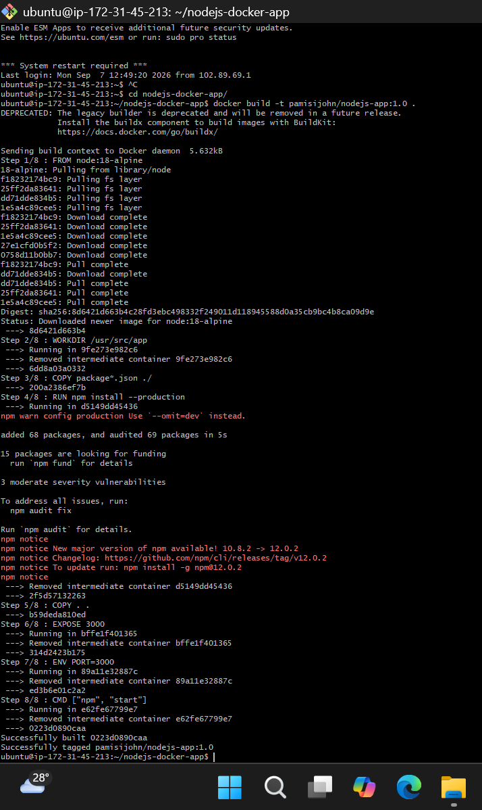
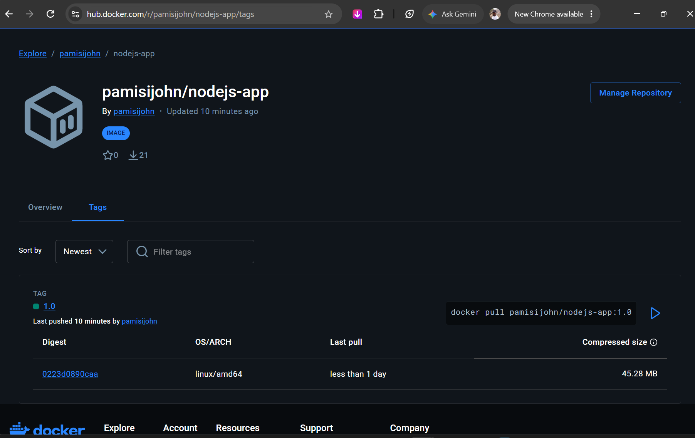
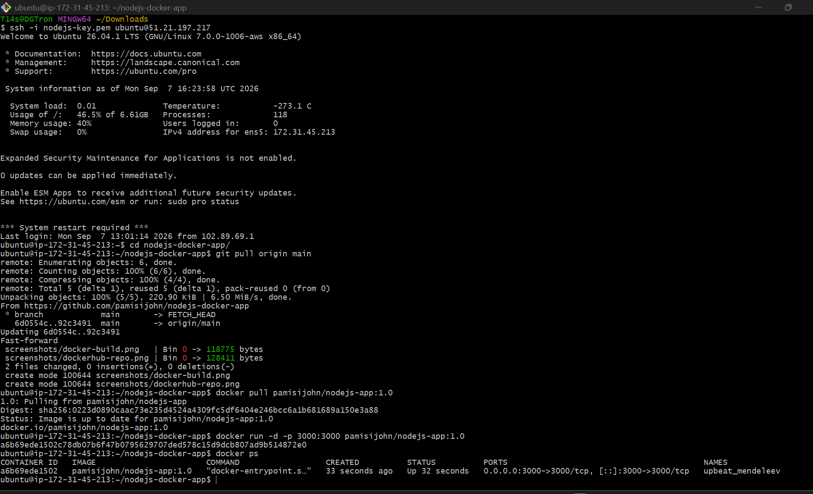
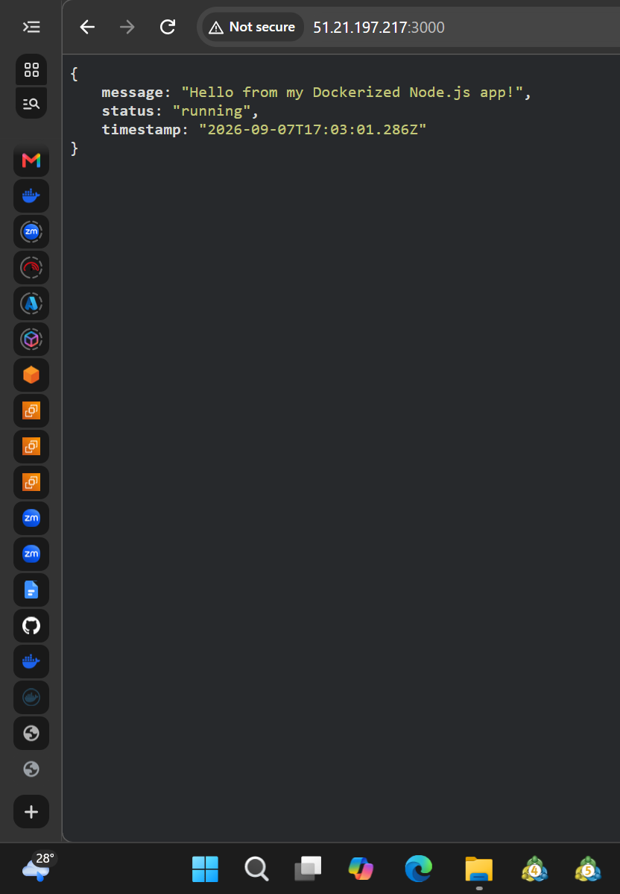

# Node.js Docker Deployment Demo

A simple Node.js (Express) application, containerized with Docker and deployed via Docker Hub.

## App Overview
- `GET /` — returns a JSON welcome message
- `GET /health` — health check endpoint
- `GET /api/info` — returns basic app/runtime info

## Files
- `app.js` — application entry point
- `package.json` — dependencies and start script
- `Dockerfile` — image build instructions
- `.dockerignore` — files excluded from the Docker build context

## Run Locally (without Docker)
```bash
npm install
npm start
# visit http://localhost:3000
```

## Build the Docker Image
```bash
docker build -t your-dockerhub-username/nodejs-app:1.0 .
```
**Screenshot — Docker build command & successful build:**



## Push to Docker Hub
```bash
docker login
docker push your-dockerhub-username/nodejs-app:1.0
```
**Screenshot — Image visible on Docker Hub:**



## Pull and Run the Container
```bash
docker pull your-dockerhub-username/nodejs-app:1.0
docker run -d -p 3000:3000 your-dockerhub-username/nodejs-app:1.0
docker ps
```
**Screenshot — Container running (`docker ps`):**



## Live Application
Visit `http://<your-server-ip>:3000` in a browser or use curl:
```bash
curl http://localhost:3000
```
**Screenshot — Application running successfully:**



## Author
John Pamisi — Your Docker Hub username: `pamisijohn`
